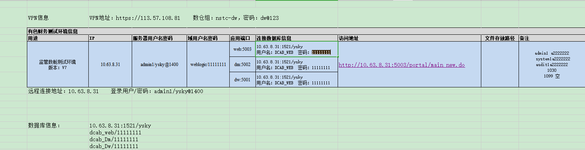

## 监管数仓测试环境

### 数据库信息：	
1. [ip|sid]= 10.63.8.31:1521/ysky
2. [user|pass]=dcab_web/11111111
3. [user|pass]=dcab_Dm/11111111
4. [user|pass]=dcab_Dw/11111111
	

##KETTLE数据源配置
#业务系统数据源配置
ORAIN/type=javax.sql.DataSource
ORAIN/driver=oracle.jdbc.driver.OracleDriver
#地址，需要修改
ORAIN/url=jdbc:oracle:thin:@10.63.8.11:1521/ysky
#用户名，需要修改
ORAIN/user=ysky_sms92
#密码，需要修改
ORAIN/password=Ysky123

#监管数舱数据仓库数据库配置
#ORAOUT/type=javax.sql.DataSource
#ORAOUT/driver=oracle.jdbc.driver.OracleDriver
#地址，需要修改
#ORAOUT/url=jdbc:oracle:thin:@10.63.8.31:1521/ysky
#用户名，需要修改
#ORAOUT/user=dcab_dw
#密码，需要修改
#ORAOUT/password=11111111

ORAOUT/type=javax.sql.DataSource
ORAOUT/driver=oracle.jdbc.OracleDriver
ORAOUT/url=jdbc:oracle:thin:@10.63.8.31:1521/ysky
ORAOUT/user=dcab_dw
ORAOUT/password=11111111

nstc/jdbc/DmData/type=javax.sql.DataSource
nstc/jdbc/DmData/driver=oracle.jdbc.driver.OracleDriver
nstc/jdbc/DmData/url=jdbc:oracle:thin:@10.63.8.31:1521/ysky
nstc/jdbc/DmData/user=dcab_dm
nstc/jdbc/DmData/password=11111111

nstc/jdbc/DwData/type=javax.sql.DataSource
nstc/jdbc/DwData/driver=oracle.jdbc.driver.OracleDriver
nstc/jdbc/DwData/url=jdbc:oracle:thin:@10.63.8.31:1521/ysky
nstc/jdbc/DwData/user=dcab_dw
nstc/jdbc/DwData/password=11111111

ORAIN_NEW/type=javax.sql.DataSource
ORAIN_NEW/driver=oracle.jdbc.OracleDriver
ORAIN_NEW/url=jdbc:oracle:thin:@10.63.8.11:1521/bill
ORAIN_NEW/user=bill
ORAIN_NEW/password=11111111

